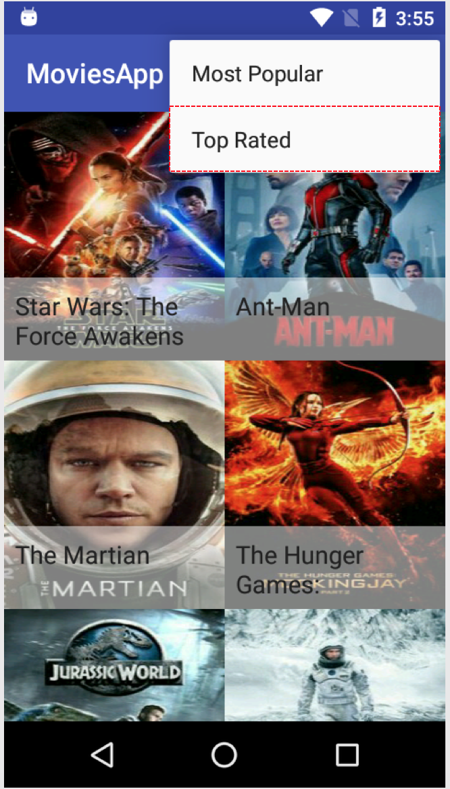

# Udacity.MoviesApp

## Screenshot

### Home-Page


### Home-Page with menu


### Movie Detail Page


## Update api key

```
cp app/src/main/assets/key.properties_sample app/src/main/assets/keys.properties 
```

and put movies.key value in keys.properties

```
movies.key=xxx
```

## Maintainer

Ajay Bhatt - <a href="mailto:ajaybhatt17@gmail.com">ajaybhatt17@gmail.com</a>